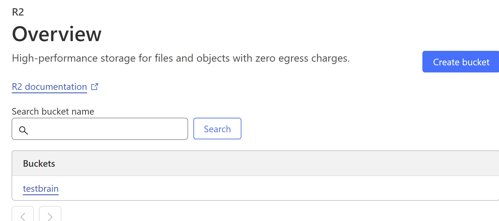
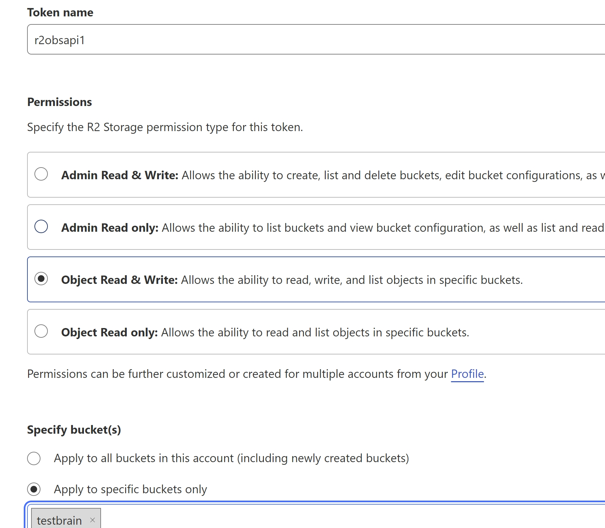
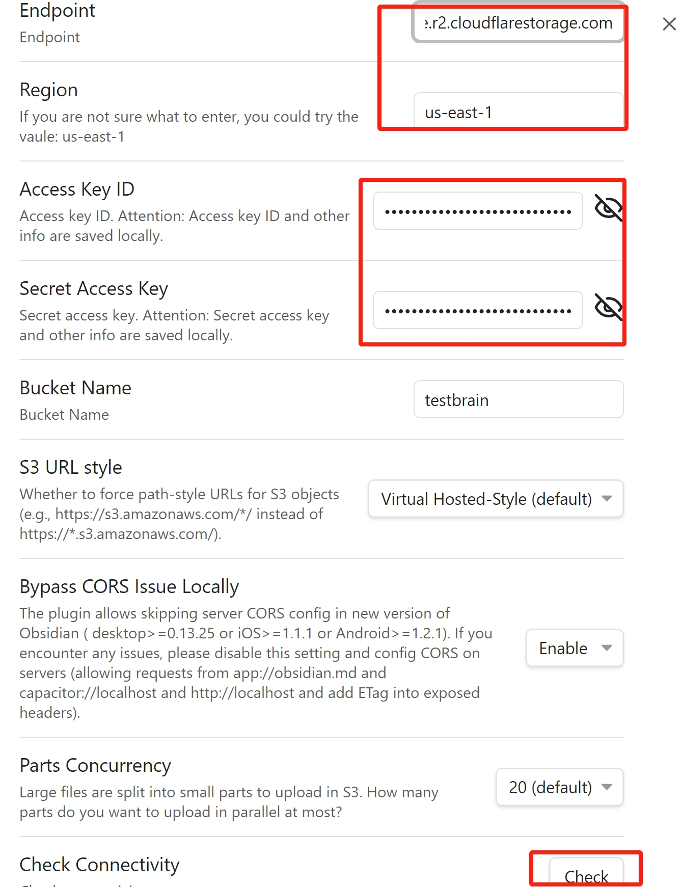

# Cloudflare R2
> [!IMPORTANT]
> Though Cloudflare R2 provides a generous free tier, be aware that heavy usage may incur charges.

## Links
<https://www.cloudflare.com/developer-platform/r2/>

## Steps
> [!TIP]
> Ensure you're using the latest version of the plugin. Improvements to connection testing for Cloudflare R2 are included in versions >= v0.3.29.

1. **Configure Cloudflare R2 Storage**
   1. Create a Cloudflare account
      > **NOTE**: A credit card may be required.
   3. Enable the Cloudflare R2 Storage feature.
   1. [Create an R2 bucket](https://developers.cloudflare.com/r2/get-started/#2-create-a-bucket).  
      
   1. [Create an Access Token](https://developers.cloudflare.com/r2/api/tokens/)
      > **NOTE**: A user-level API token is recommended as best practice, but you may choose account level if you prefer.

      1. Choose a descriptive name for the token (e.g. `yourname-obsidian`).
      1. Choose `Object Read & Write` as the permission type.
      1. Scope the access to your bucket only.
      2. **KEEP THIS TAB OPEN FOR REFERENCE**  
         

1. **Configure the Remotely Save plugin**
   1. Go to the Remotely Save plugin settings.
   1. Enter the bucket endpoint:  
      **Endpoint**: `https://<endpoint>.r2.cloudflarestorage.com` or similar from your bucket properties overview.  
      **Bucket**: `obsidian` or whatever bucket name you chose above.  
      **Acccess Key**: `<access_key>` from your token creation tab.  
      **Secret Key**: `secret_key` from your token creation tab.  
      **Region**: `us-east-1`  
   1. Click `Check Connectivity`.
      > **NOTE**: A success message will indicate you a good configuration. If there is no success message, double check your settings and try again.  
      

1. Sync!
